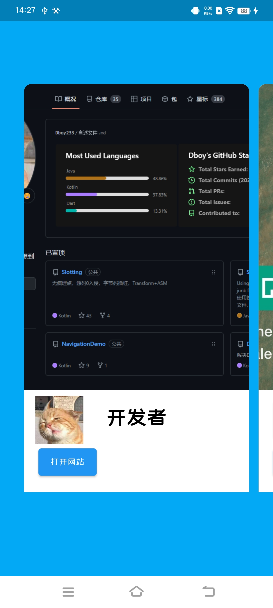
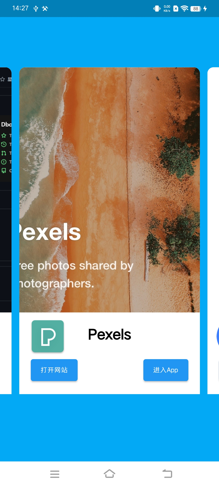
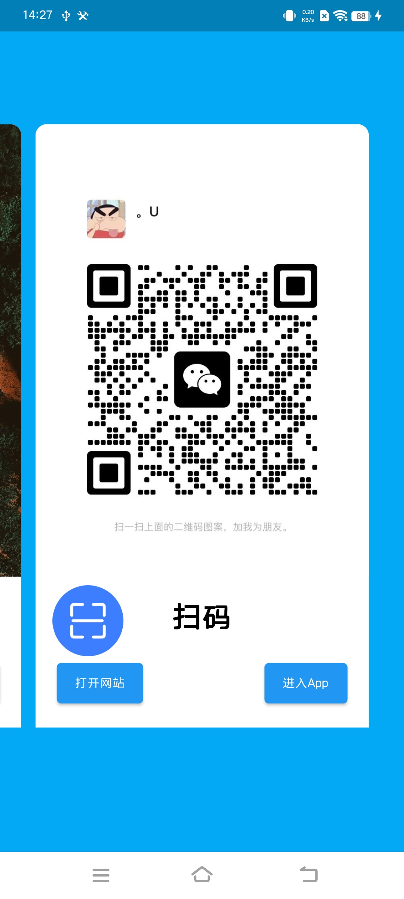
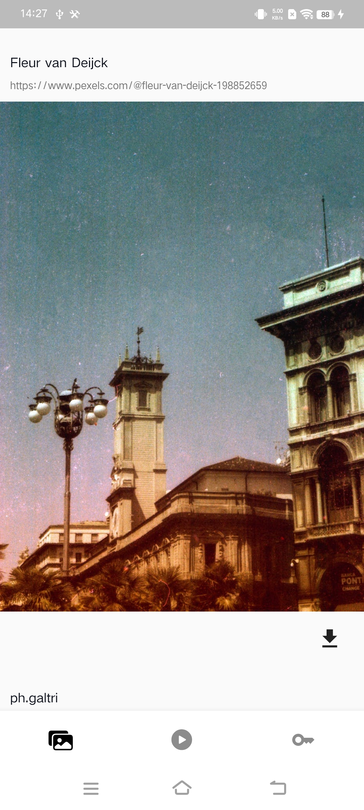
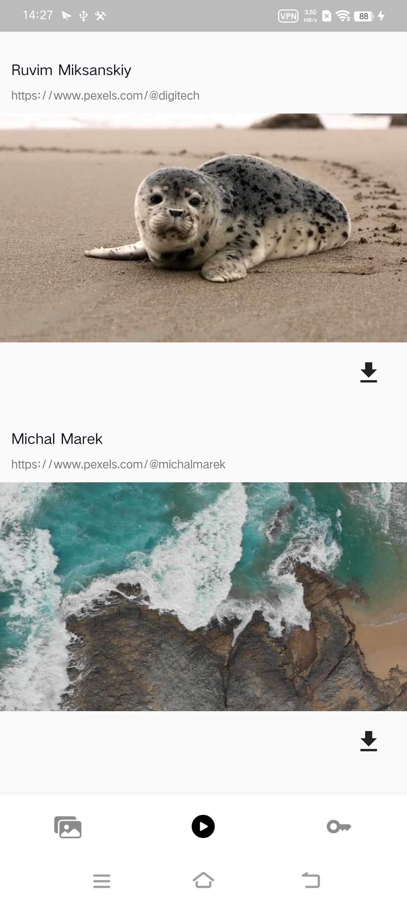
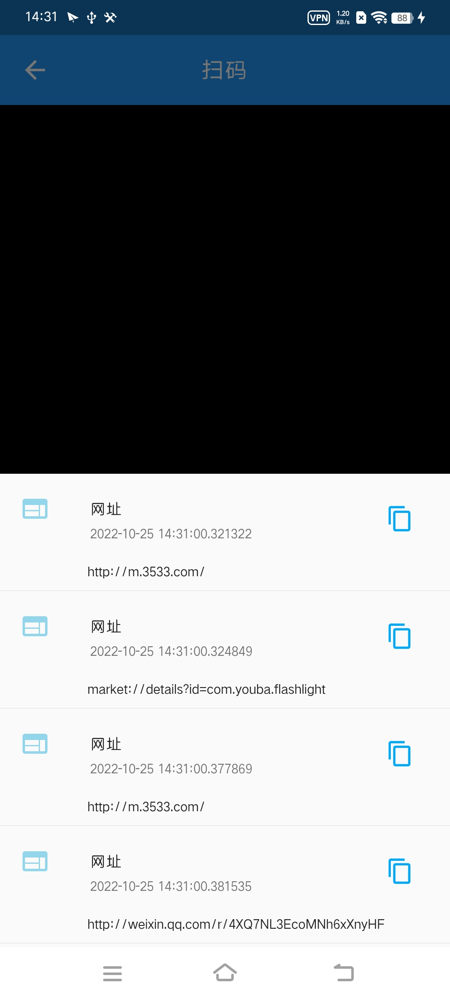
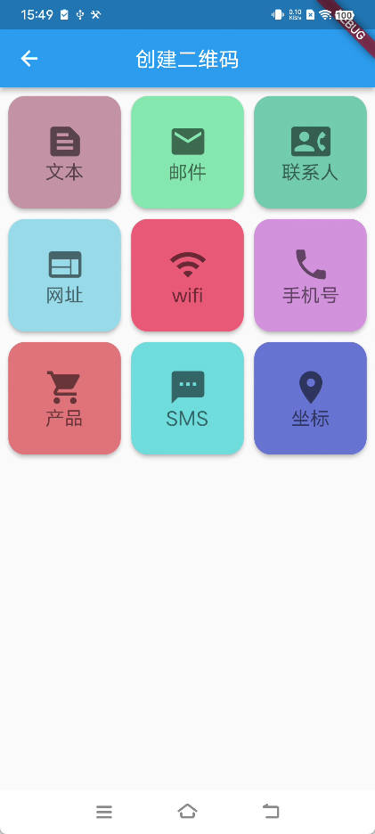
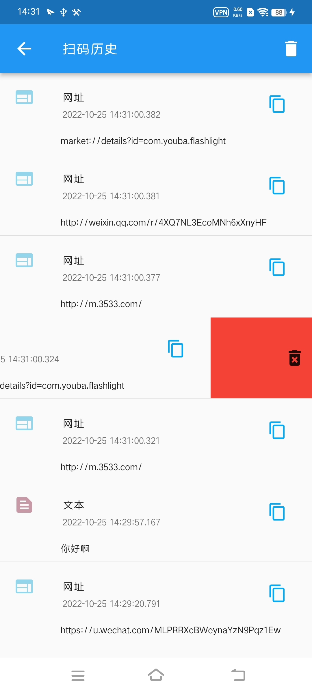

# Flutter Tools 合集


flutter 开发的各种工具app合集。持续更新中。[截图预览](#截图)

Android 端已经完全适配。

ios端已经基本适配完成，有待进一步测试。

当前项目使用的第三方库:

```yaml
  #状态管理框架
  get: ^4.6.5
  # 屏幕适配框架
  flutter_screenutil: ^5.5.4
  #本地数据库
  objectbox: ^1.6.2
  objectbox_flutter_libs: ^1.6.2
  #打开网站
  url_launcher: ^6.1.6
  #网络
  dio: ^4.0.6
  #ios android 图片保存，其他平台另外处理。
  image_gallery_saver: ^1.7.1
  #ios android平台权限申请框架
  permission_handler: ^10.1.0
  #图片查看工具
  photo_view: ^0.14.0
  #视频播放器
  video_player: ^2.4.7
  chewie: ^1.3.5
  #扫码
  mobile_scanner: ^2.0.0
  #生成二维码
  qr_flutter: ^4.0.0
  #异步框架
  async: ^2.9.0
  #可视区域检测
  visibility_detector: ^0.3.3
  #将Widgetc转成Image
  widgets_to_image: ^0.0.2
  #本地存储工具
  shared_preferences: ^2.0.15
  #高德插件
  amap_flutter_base: ^3.0.0 #基础库
  amap_flutter_map: ^3.0.0 #地图库
  amap_flutter_location: ^3.0.0 #定位库
```

`Pexels`需要申请一个APIKey 用于图片和视频的数据请求-[连接地址](https://www.pexels.com/zh-cn/)
  
  1. 注册一个Pexels的账号
  2. 在个人信息中`图片和视频API`中查看你的KEY。然后可以修改项目中代码替换，也可以运行项目之后在pexels页面，底部导航栏key选项修改。
  
  `高德地图`去官网申请自己的高德地图API-key [连接地址](https://lbs.amap.com/dev/#/)
   
   1. 需要同时申请Android端 `apikey` 和 ios端 `apikey`
   2. Android端在android/local.properties文件中添加一行 `amap_key=***`,`***`是你申请的key。注意不要有`""`。
   3. IOS端适配中。。。fk
   
   权限申请框架根据需要修改配置。
   1. Android 端没啥说的。
   2. ios端，虽然我吧Podfile 和 Podfile.lock 上传了。免不了会出现问题，权限在Podfile中有表明，用到什么权限解除注释即可。
   
   ```
  
post_install do |installer|
  installer.pods_project.targets.each do |target|
    flutter_additional_ios_build_settings(target)

    target.build_configurations.each do |config|
    config.build_settings['GCC_PREPROCESSOR_DEFINITIONS'] ||= [
            '$(inherited)',

            ## dart: PermissionGroup.calendar
            # 'PERMISSION_EVENTS=1',

            ## dart: PermissionGroup.reminders
            # 'PERMISSION_REMINDERS=1',

            ## dart: PermissionGroup.contacts
            # 'PERMISSION_CONTACTS=1',

            ## dart: PermissionGroup.camera
            'PERMISSION_CAMERA=1',

            ## dart: PermissionGroup.microphone
            # 'PERMISSION_MICROPHONE=1',

            ## dart: PermissionGroup.speech
            # 'PERMISSION_SPEECH_RECOGNIZER=1',

            ## dart: PermissionGroup.photos
            'PERMISSION_PHOTOS=1',

            ## dart: [PermissionGroup.location, PermissionGroup.locationAlways, PermissionGroup.locationWhenInUse]
            # 'PERMISSION_LOCATION=1',

            ## dart: PermissionGroup.notification
            # 'PERMISSION_NOTIFICATIONS=1',

            ## dart: PermissionGroup.mediaLibrary
            # 'PERMISSION_MEDIA_LIBRARY=1',

            ## dart: PermissionGroup.sensors
            # 'PERMISSION_SENSORS=1',

            ## dart: PermissionGroup.bluetooth
            # 'PERMISSION_BLUETOOTH=1',

            ## dart: PermissionGroup.appTrackingTransparency
            # 'PERMISSION_APP_TRACKING_TRANSPARENCY=1',

            ## dart: PermissionGroup.criticalAlerts
            # 'PERMISSION_CRITICAL_ALERTS=1'
          ]
          end
  end
end

   ```
   
   
   > ios端有些坑需要避一下，对于Android原生开发，ios是个盲区啊。我艹了。
   
   如果没有Podfile或者你想修改Podfile。现在假设没有。在终端中进入`ios/`目录执行命令 ` flutter build ios ` 会创建Podfile和Pods/目录。 
   
   然后再执行命令 `pod install` 会安装对应的第三方依赖库,生成Podfile.lock文件。
   
   如果提示找不到.symlinks/目录下的XXX文件。90%是tm第三方库插件的问题，这让我换了好多库，气死了。
   
   进行`ios`构建的时候，可能会报版本不适配的错误，由于第三方库插件的最低适配`IOS Version` 低导致的。例如我这里是 11，插件的最低版本是 9，就会报错。根据XCode的错误提示，对第三方库的配置信息进行修改即可。
   
   
   
   


# 截图

|  |  |
| ------------------ | ------------------ |
|  |  |
|  |  |
|  |  |
|  |                    |


